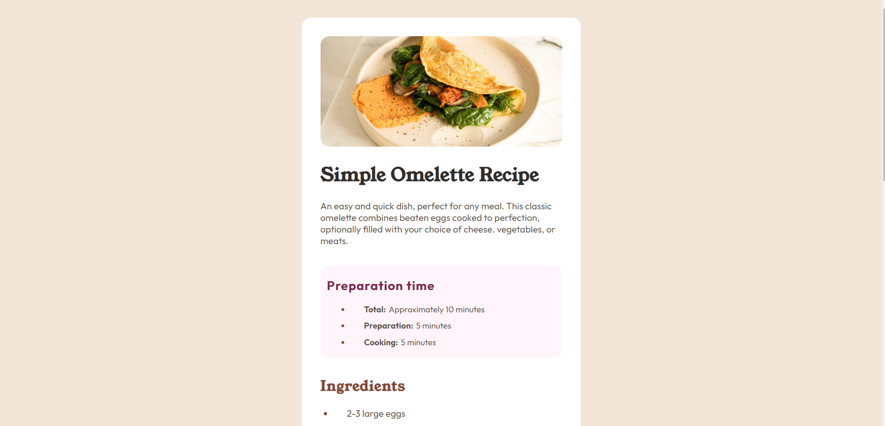

# Frontend Mentor - Recipe page solution

## Overview

### Screenshot

### Links

- Live Site URL: [here](https://vaibhav-sanghi.github.io/recipe-card-frontendmentor/)

### Built with

- HTML
- CSS
- CSS Table
- Mobile-first workflow

### What I learned

- how to design with a mobile first approach
- styling lists and tables

## Author

- Frontend Mentor - [@Vaibhav Sanghi](https://github.com/Vaibhav-Sanghi)
